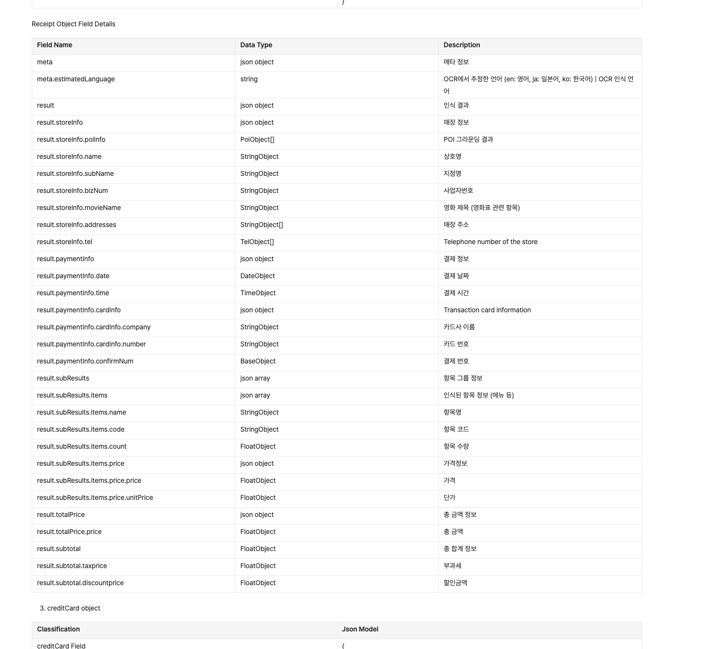
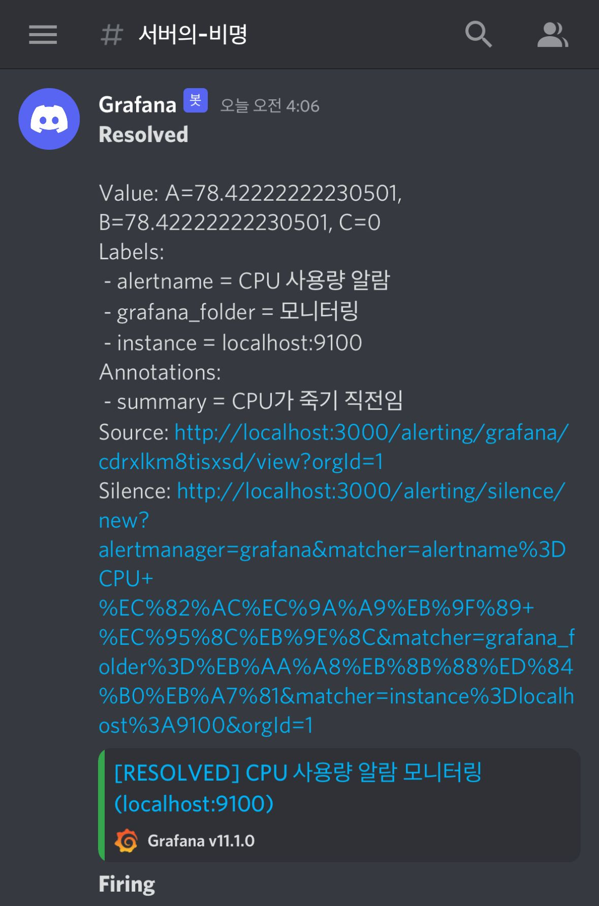

지난 PM편에 이어, 개발 회고.

PM으로 느꼈던 것도 많지만, 개발을 하면서 느꼈던 점도 참 많았다.

**영수증 사진 첨부**라는 기능에서 나름대로 머리를 굴렸던 시간들을 풀어 보고자 한다.

의사결정을 되짚어 보고, 잘한 부분은 무엇일지, 개선할 점은 없었는지 다시 한번 생각해 보고 싶다.

> **압축 정리**

> 💡 **개발자로서 비즈니스 효율 개선하기**

- **`Make or Buy?`** **→ Buy**를 통한 시간적 효율 증대 / HR 리소스 확보

- 5 뎁스 이상 **`비정형적 JSON 데이터`** **RDB 적재** 하기

- **`대용량 사진 업로드`**의 압축 및 비동기 처리 → 시간 / 공간 효율 및 사용자 경험 증대

- **인프라 효율 증대**를 통한 `모놀리틱` / 다중 도메인 1대 서버 도입 → 운영 비용 감소

- **`HA`**: 포트 변경을 통한 무중단 배포 도입

---

# Make or Buy?

이 프로젝트의 가장 큰 목적은 **영수증을 찍어서 올리면 자동으로 DB에 적재**가 되도록,

**경비 처리를 위해 수기로 작성하는 시간을 최소화**하는 것이었다.

따라서 현 프로젝트 안에서 가장 핵심 기능은 **OCR**.

무료로 제공하는 OCR 라이브러리들을 살펴봤지만, 영수증은 카드사 / 밴더마다 모양이 굉장히 다르기도 하고, 가져올 키 값이 명확하지 않은 경우가 많았다.

> `OCR 라이브러리를 통해 텍스트를 따서
> → 다시금 문자열로 바꿔서
> → 우리가 원하는 정보를 가져온다`

그렇다면 문자열로 바꾸는 것을 Make해야 하는 상황이 되는데…

**이 구조가 현재 프로젝트에서 가지는 강점**이 있을까? 내 대답은 No였다.

파싱을 통해 키에 값을 대입하는 건 시간이라는 자원을 손해본다는 생각이 들었다. 또한 모듈 유지보수는..?

(개발 공부 차원에서는 재미있어 보이지만, 사내일지라도 서비스인 만큼 도입에 대한 신중함을 기하고자 했다.)

따라서 **한국의 영수증을 찍고 주요 값을 받아올 수 있는 템플릿**을 제공하는, `Clova AI OCR`을 도입하기로 하였다.

# 영수증 AI json이 길어요? 없어요?

> 네이버 영수증으로 인증해 본 경험이 있나요?

> 💡

**영수증 데이터 빠르게 적재하기**

- 영수증을 찍어서 나온 OCR JSON 데이터 적재 개선
  - **`5단계 이상 뎁스`**가 깊은 데이터 → 객체 생성 비용 삭제 / Object to String
  - **`비정형적`**: 원하는 데이터의 NPE 발생 → 기본 값 부여

그리고 나서 맞이한 두 가지 문제 상황.

## 5 Levels JSON?

- **문제 1**: 영수증 데이터로 날아오는 json이 매우 길고 뎁스가 깊다.

사진을 찍고 추출해낸 OCR 결과물은 처참(?)했다. **최대 5 뎁스에 해당 텍스트의 좌표**까지 반환해 주었던 것이다.

나는 총 금액과 가맹점 이름, 날짜, 카드 정보만 가지고 오면 되는데…

**내가 원하는 정보를 찾기까지의 규모**가 너무 컸다.

내가 일반적으로 JSON 객체를 사용하던 방식은, Gson 등의 역직렬화 라이브러리를 사용해 **받아온 키에 대해 객체**를 만들고 **Key에 대한 값을 필드**로 매핑해 사용하는 것이었다.

문제는, 해당 JSON을 담으려면 클래스 안의 클래스 안의 클래스 안의 클래스 …. 구조가 나왔다. (키가 180개 정도 됐다.) 심지어 JSON 데이터 안에는 해당 텍스트들의 좌표 주소가 전부 존재했다.

여러 가지 안을 고민하다 `Object-get` 방식을 도입하기로 했다.

> **Gson을 통해 Json 값을 추출**한 뒤, `일부러 객체 생성을 하지 않고`,
> **Object 상태에서 Fluent 스타일로 get을 한 뒤 사용**했다. (get의 get의 get…)

객체 생성 비용 절감과 함께, 어차피 클래스를 만들어도 get을 위해서는 해당 작업이 필요하기 때문에 내린 결정이었다.

이후 API 문서를 기반으로 작업을 한 다음 매핑했고 잘 돌아가고 있었다.

그런데…

---

## Core Key NPE?

- **문제 2**: 영수증 데이터로 날아오는 json Key 중 안 오는 것이 있다.

처음 API 문서를 봤을 때는 해당 값이 전부 날아오는 것이라고 생각했다.

그에 따라 옵셔널이라는 객체 생성 비용을 만드는 선택을 하지 않았다.

문제는 테스트 중에 발생했다. `갑자기 특정 영수증에서 NPE가 발생`했던 것이다.

데이터를 살펴 보니, API 반환 값 중 **해당 키가 언제는 떨어지고 / 언제는 떨어지지 않는 방식**으로 되어 있었다.

갑자기 Null이 발생한다면, 내가 필요한 데이터의 키값은 정해져 있으니 JSON 데이터를 **클래스에 매핑해** 기본 값을 미리 할당하고 덮어씌움으로써 NPE를 제어했다.

해당 내용에 대해서는 사용자에게 고지하는 방법을 고려했는데,

현재 코드는 이미지 업로드 5개 중 일부만, 심지어 0개만 성공하더라도 200을 돌려주는 전략을 선택하고 있었다.

200을 돌려주면서 이미지 당 문제가 생긴 부분을 고지했는데,

해당 방식과 똑같이 orThrow 처리를 통해 업로드 후 얼럿을 통한 방식을 선택했다.

- **문제? : 영수증 인식이 정확하지 않다.**

문제 사항은… 하나가 더 있다. 영수증 인식률이다.

그나마 다행(?)이라고 할 수 있는 점은, 네이버도 우리와 같은 문제를 안고 있었다는 것이다.

같은 영수증의 경우에도 **어떻게 찍느냐**에 따라서 파싱 여부가 달라졌다. 밝기의 차이로 달라지는 경우도 있었다.

주변 사례를 들어 보니, **네이버 후기에서 영수증을 찍을 때에도 동일한 이슈가 발생**한다고 한다.

**우선 API에서 반환해 주는 인식률이** **`0.6 이하`****일 경우 인식 불가능 에러**를 떨어뜨려 주고 있지만,

생각보다 사용자 입장에서는 인식률이 떨어진다고 여기는 경우가 많은 것 같다.

이 부분은… 클로바가 쑥쑥 발전하는 것을 기다려 보겠다. ^^;

# 영수증 업로드가 이렇게 느리다고?

> 동기를 깨부수자!

**기존 로직의 상태.**

> ———————————————————————————————————————————

1. `multipart/form-data` 통신 안에 `files`로 **사진 파일 배열**을 담아서 통신을 보낸다.

1. 서버에서는 files에 대한 **for문**을 돈다.

1. `외부 API 1`: Object Storage에 파일을 올린다.

1. `외부 API 2`: Object Storage에 올린 파일의 권한을 공개로 해제한다.

1. `외부 API 3`: Clova와 통신을 통해 영수증 데이터를 가져온다.

1. 반환받은 **Clova json 데이터**를 우리가 적재하고 싶은 모양으로 변환한다.

1. for문이 끝나고 **모든 통신이 완료되면 응답**을 받는다.

————————————————————————————————————————————

이 **모든 로직이 동기적**으로 실행되고 있었다.

|   | **OCR SMALL** | **OCR LARGE** |
| --- | --- | --- |
| **1개** | 약 3초 | 약 3초 |
| **2개** | 약 4초 | 약 7초 |
| **5개** | 약 10초 | 약 17초 |

그에 따라 받은 결과물은, 현재 상황에서 요구사항에 맞춘 데이터를 올렸을 때 **17초**라는 경이로운 시간을 보여 준다는 것이다.

음… 사용자가 이 시간을 유쾌하게 여길 것 같지 않다.

그에 따라 이를 개선해 본 결과!

| 처리 개수 | OCR SMALL | OCR LARGE |
| --- | --- | --- |
| 1개 | 0.2초 | 0.2초 |
| 2개 | 0.4초 | 0.4초 |
| 5개 | 0.9초 | 1.0초 |

**사용자의 업로드시 체감 속도, 응답성은 13~18배 가량 향상**되었다.

꽤 괜찮은 개선 결과인 것 같다.

하려고 했는데, 아쉽게도 페르마가 아니고 인터넷 세상이라 글을 열심히 적어다 올려 두었다.

[이미지 효율화: verson 1](https://www.notion.so/2d03453c50544e70b3b79292b5260e33) : [시나리오 2](https://www.notion.so/2d03453c50544e70b3b79292b5260e33#18de1ea9c279808eb380fb75b22d27e6)

이 글보다 재밌는(?) 글이니, 한번 봐주셔도 절대 시간이 아깝지는 않으실 것 같다.

(version 2는 아직 글을 적고 있는데, 금방 올려 두도록 하겠다.)

# 서버 하나에 도메인이 N개라고?

## 서버 비용 절감

> **서버 비용 절감 수단: Nginx 도입**

- 리버스 프록시를 반대로, `하나의 서버에 할당하는 다중 도메인`

- 사내 서비스인 만큼 많은 트래픽을 예상하지 않음

- 따라서 `하나의 서버에 다른 포트로 화면 / 서버를 전부 대응`

그리고 인프라 이야기.

Nginx 도입에 대한 의사결정 이야기를 해 보고 싶다.

요즘 트랜드와 역행하는, **여러 도메인을 하나의 서버에 연결하는 작업**을 했기 때문이다.

**최근의 서버 트렌드**는 리버스 프록시를 통해 스케일아웃으로 트래픽을 분산하는 것임을 알고 있다.

그러나 내가 파악하고 있는 개발자의 소양 중 하나는 `필요한 기술을 적재적소에 대응하는 것`이라고 생각한다.

교육 차원, 동시에 사내 전용으로 진행하는 프로젝트에서 메인 환경을 분산 시스템으로 / 다중 서버로 접근하는 것은 **오버엔지니어링**이라고 여겼다.

**동시에 비용적 측면을 고려**하였다. 분산하는 경우 N개의 서버를 두어야 하는데, 하나의 서버로 충분히 개발과 운영이 감당 가능한 트래픽인 상황에 굳이 서버를 하나 더 둘 이유가 있을까?

따라서 최근의 트렌드와는 역으로, **Nginx를 프록시로 도입**했다.

하나의 서버 안에서 포트를 분리해 프로그램을 올리고, 개발 앱 / 운영 앱 / 개발 어드민 / 운영 어드민 4개의 도메인을 설정했다.

**포트가 분리되어 있기 때문에 배포 시 서로의 서비스에는 영향을 주지 않는다.**

SSL 인증서는 도메인마다 개별적으로 적용했는데, **Let's' Encrypt**를 통해서 진행하였다.

이 부분도 주기적 갱신이 필요하므로 배치를 돌려 두었지만, 추후 인증서 하나로 멀티 도메인을 지원할 수 있는 인증서를 도입해 갱신 한 번으로 모든 SSL 인증을 허용하도록 처리하려 한다.  (비용이 들지만…)

다만, 이 케이스에서 한 가지 고려해야 할 상황은 존재한다.

**하나의 서버.**

**서버가 다운되는 순간 모든 서비스가 멈추는 일**이다.

## 무중단 배포와 무중단 서비스

> **불필요한 서버 다운을 방지하기**

- nginx 파일을 통해 서브 도메인을 변경

- 모니터링 시스템 + 임시 서버 이중화

위의 의사결정에 따라, 결국 우리의 서버는 한 대다.

따라서 배포 시 해당 도메인에 대해서 서버 다운이 일어난다.

무중단 배포를 위해 Nginx를 통해 해당 포트 배포 시 잠시 **신규 인스턴스를 만들어 서비스 포트를 일시 변경하는 블루-그린 전략을 적용**하였다.

또한 서버의 메모리가 치솟거나, 서버가 갑자기 뻗을 때면 앱과 어드민이 둘 다 죽어비리는 현상이 발생할 수 있다.

서버 메모리에 대해서는 **Prometheus + Grafana를 통한 모니터링 시스템을 구축**해 서버 자원 사용률에 대해 디스코드로 알림을 설정해 두었다.

그러나 해당 서버가 멈추는 경우 전체 시스템이 흔들리는 것은 여전할 것이다.

이에 따라, 긴급 상황 시 바로 구동해 연결할 수 있도록 **Auto Scaling** 설정을 통해 최소 인스턴스를 1로 지정하는 전략을 설정했고,

또한 신규 인스턴스 생성 시 **AWS 람다가 트리거**되도록 하여, 지정된 DNS에 물려 있는 엘라스틱 IP를 해당 인스턴스에 할당하도록 구상하였다.

---

# TO-BE.. 였으나.

- 구현을 목표로 하였으나 시간상의 목적으로 구현하지 못한 아이디어들을 적어 둡니다.

## 외부 API, 고장나면 어떡해?

> 서킷 브레이커 도입

## 외부 API, 갑자기 통신 못하면 어떡해?

- 현재 사진 촬영 한번에 달린 외부 API가 3개(!)의 상태

- 하나의 트랜잭션으로 잡을 경우 락 시간 등 비효율적 트랜잭션 관리가 일어남 - 멱등성 / 가용성 떨어짐

- 비동기로 어느 정도 해결하였으나 통신이 안 되는 케이스에 대한 대응 필요

- 3가지 진행 중 1가지 / 2가지만 완료되었을 경우에 대한 효율성 증대

> 멱등성 키 도입

> 재시도 전략 : 3번 재시도 및 백오프

> 이미지 업로드 (1번 통신) 실패 시 전체 취소

> 이미지 업로드 성공 시 권한 해제 재시도 → 3번 실패 시 전체 취소

> Clova OCR 실패 시 앱에서 버튼으로 재시도 가능

## 이미지 조회, 너무 느리다!

> 디바이스에 이미지 캐싱하기

… 라고 계획하고 있었는데.

해당 구현들을 진행하려던 순간 하나의 일이 생겨났다.

대표님이 내가 구현한 앱을 보고 감명 깊으셨던 것인지….

**10년 가까이 기획 가안만 나온 채로 곳간에 묵혀 있던 먼지 가득 PMS 어드민 프로젝트**가 꺼내진 것이다.

해당 구현은 영수증 관리를 포함하는 만큼 기존 서버 소스를 기반으로 작업을 해나가기 시작했는데…

역시나 마이그레이션은 쉽지 않은 일이다.

다음 글은 해당 앱과 신규 프로젝트를 마이그레이션하면서 겪었던 과정에 대해 적어 보려고 한다.
