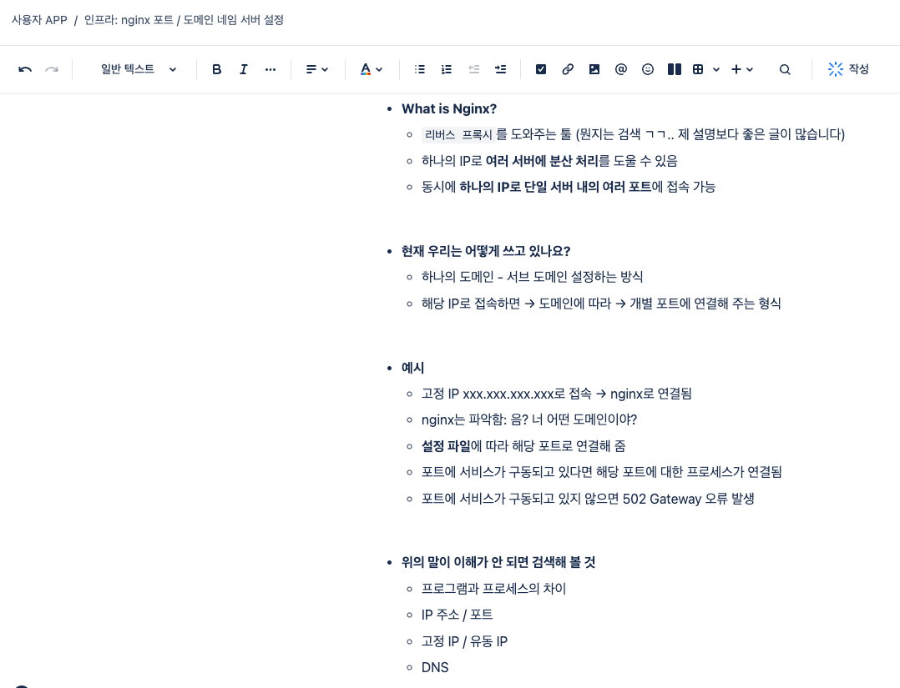
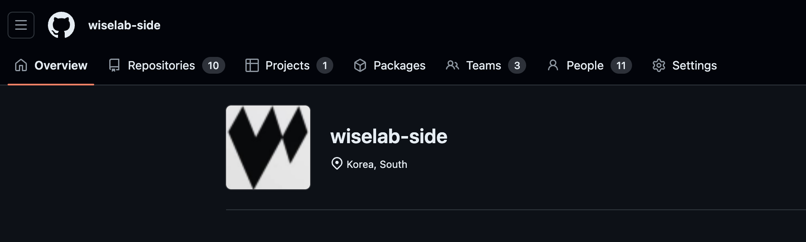
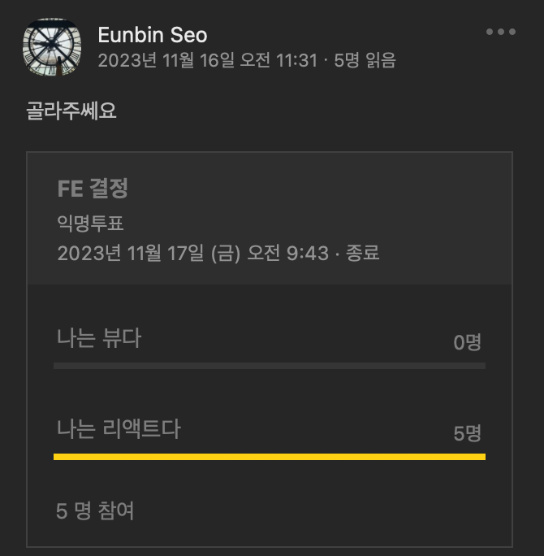
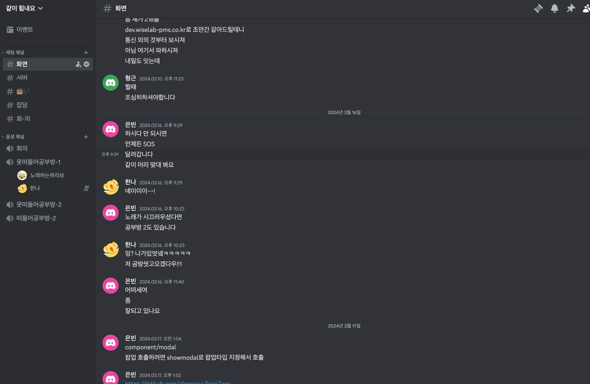
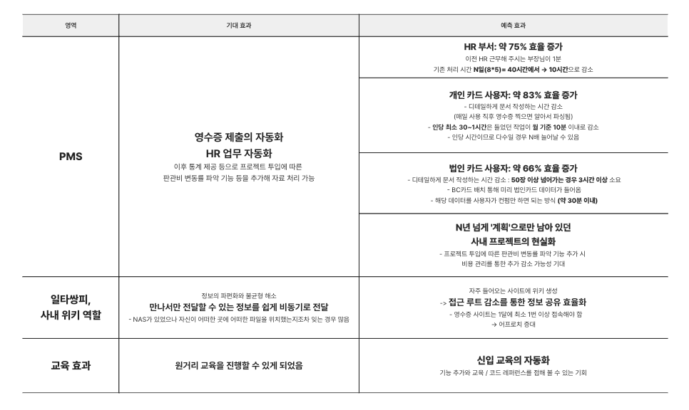
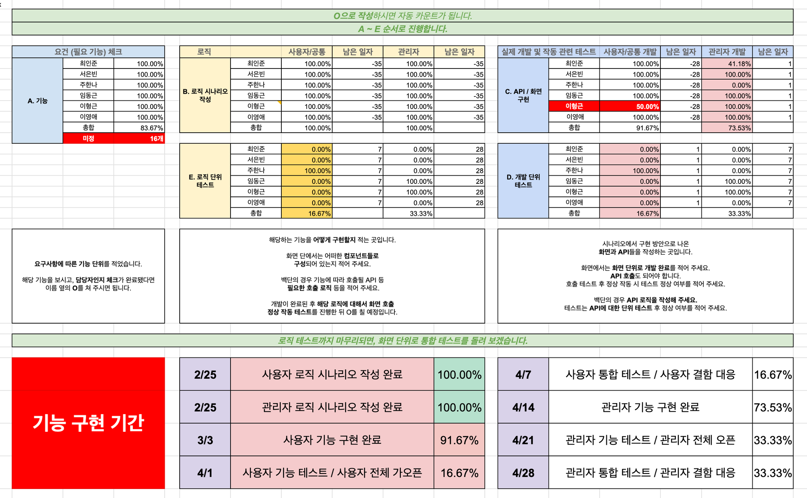

회사 사이드 프로젝트 매니징 리턴!

이번 주 **회사 지출경비 사내 앱 베타 버전 런칭**이 완료된다.

그에 따라 영수증 PMS 베타 버전의 PM으로서 느꼈던 지점에 대해서 회고해 보고자 한다.

> 💡 **PM으로서 비즈니스 효율 개선하기**

- **핏이 맞는 도구 = 우리 팀에 맞는 도구  (힙한 도구 ≠ 우리 팀에 맞는 도구)**

- **`의견 수렴과 비동기적 작업 방식`** **도입**으로 자발적 참여와 **프로젝트 일정 준수**를 유도

- **조직에 맞는 교육과 협업 체계 구축**으로 `지식적 갭 감소 / 프로젝트 완성도`를 높임

> **비즈니스 관점에서 프로젝트 돌아보기**

-  66h~110h
  - HR 부서 (30h)
  - 회사 인원 36명 * (평균 1h~1.5h)  = 36h~54h

---

# PM?

> 좋은 “개발 결과물”을 위한 여정

PM의 역량은 뭘까?

무 자르는 것처럼 정확하게 딱 가를 수는 없겠지만, 내가 생각하기에 **PM으로서 고려해야 하는 것은 두 가지** 같다.

- **퀄리티가 보장되는 결과물**

- **일정을 정확한 기간 안에 소화**

이 두 가지에 대해 내가 진행했던 방식을 이야기해 보면서,

이번 진행 프로젝트의 기대 효과 / 예상 효과와 아쉬웠던 점에 대해서도 이야기해 보고자 한다.

# 1. 퀄리티가 보장되는 결과물

> 핵심 포인트 **⇒ 개발에 드는 비용 감소**

퀄리티를 올리는 데는 여러 방법이 있다. 그 중 하나는 도와주는 것이다.

개발을 도와준다는 것은 무엇일까?

내 생각에는 **개발에 드는 비용을 고려**한 다음 **적절하게 제어**해 주는 것이다.

개발 안에서는 커뮤니케이션, 이슈 공유, 버전 관리 등이 있을 것이고,

매니지먼트 측면에서는 프로젝트 현황 파악 등이 있겠지.

해당 비용들을 “감소”시키는 것이 개발 프로세스의 역할이자 핵심이라고 생각한다.

그리고 내가 내렸던 비용 감소 방안에 대해서 이야기해 보려고 한다.

## 진행 상황 공유: 개발 관련 자료 쉐어

- **노션 → Jira / Confluence → Google SpreadSheet**

프로젝트를 진행하면서 가장 변동이 많았던 부분이다.

**위키라는 시스템이 사내에 부재**했기 때문이다.

사내에서 공유하는 문서 공간은 메일과 NAS가 전부였는데, 나는 입사하고 2년이 흐를 때까지 NAS에 접속해 본 기억이 없었다.

- **Notion → Jira**

이 부분에 대해서 보완할 방향을 많이 생각해 봤고, 최초에는 노션 페이지를 사용하다 1000줄 제약에 부딪혀, 

**지라 / 컨플루언스 연동**이라는 의사 결정을 했다.

그런데 작업하다 보니 또 한 번 벽에 부딪혔다.

컨플루언스에 위지윅 에디터를 사용할 수 있는 것은 좋은데, 그리고 url 공유도 너무나 편한데…

**Jira 접속에 있어서는 다들 어렵게 접근**한다는 걸 깨달았다.

이걸 느끼고 나니 과감하게 **해당 툴을 버리고 구글 스프레드 시트를 적용**하기로 했다.

- **→ Google Spread Sheet**

예전에는, (아 지라에 있지 → 접속 → 확인하는 프로세스가 한 가지 더 추가됨) 이었다면,

이제는 **“구글 스프레드시트만 보면 다 있지”**의 영역이 되었다.

허들이 덜어짐으로써 업데이트가 늘어나 PM으로서 프로젝트 관리에 대한 능력도 늘어났다.

개발을 해 오는 동안 **`조직에게 적합한 프로세스가 적절한 프로세스`**라는 말을 참 많이 봐 왔다.

이번 의사결정을 통해 조직에게 맞는 툴이란 뭔지 몸으로 깨닫게 된 것 같다.

> → 이후 마이그레이션 작업 과정에서 팀원들이 **컨플루언스에 익숙**해지게 되었다!
> 재미있는 성과였기 때문에 한 번 더 글을 적어 볼 수 있으면 좋겠다.

## Github Organization 도입 / Github 공통 계정

최근 당연해진 Git을 통한 형상 관리.

그렇지만 상기한 것처럼 당연하다고 쓰는 것은 의미가 없다고 생각한다.

**우리 조직에게 맞고, 그에 따른 이유가 있으며, 사이드 이펙트를 이득이 뛰어넘는, 적어도 손해는 아니어야 하는 것.**

내가 Git을 택한 이유 중 가장 강력한 것은 `Github Organization` 이었다.

해당 레포에 있는 것을 허용된 팀원이면 누구나 볼 수 있고,  퇴사 시 형상 접근에 대한 인가도 다른 작업 없이 바로 적용되기 때문이다.

- **누군가의 계정에 종속되지 않는 방식을 통한 공유**

- **신입 분들 교육용으로 사용**

- **이후 과제한 분들은 해당 그룹으로 들어온 뒤 예제 코드 / 서로간의 코드를 참고할 수 있게 함**

기존 WISE IN의 경우 내 레포지토리를 통해 개발을 진행했는데, 이 케이스의 경우 **내가 private으로 레포를 돌리는 순간 접근이 제한**된다.

또한 내가 퇴사를 하면? 여기에 다른 인원이 유지보수를 할 수 있을까?

형상을 택하는 시기에, **동시에 진행하던 신입 입사자 교육 공간 구축**도 의사 결정에 도움이 되었다.

**교육용으로 레포**를 하나 만든 뒤 **fork해서 개발**하게 하고, 개발 후에야 예제 코드와 기존 신입분들 소스 코드를 볼 수 있도록 하는 형식을 구상하였다.

이러한 판단 기준에 따라 이번 기회에 **사내 공통 Github Organization**을 구축하기로 마음을 먹었다.

금융 쪽 프로젝트를 돌면서 svn이나, cvs 같은 코드 형상 관리를 경험하고 여러 가지 쓴맛을 맛보기도 했고…

신입 사원분들에게는 익숙한 방식을, 기존 분들에게는 새로운 맛을 보여 주고 싶은 마음도 있었다.

> → 마이그레이션 작업 중 조직 내 많은 분들이 깃 형상 관리에 익숙해지셨다.
> 만족할 만한 성과였다 :)

# 2. 일정을 기간 안에 소화

> 핵심 포인트 ⇒ **빠르게 하고 싶도록 하는 것**

## 자발성 묻기: 의지 넘치게 만들기

사내에서 진행하는 사이드인 만큼 기술 스택 등의 의사 결정 키가 우리에게 있어 의견을 최대한 수집하고 싶었다.

하지만 어쩐지 단톡방에서 원하는 답변은 잘 나오지 않았다.

개인적으로 대화할 때는 대화를 잘하는 분들이라 단톡방(타인이 보고 있음)인 게 큰 것 같았다.

의견을 내는 것에 대한 허들을 낮출 필요가 있다고 생각했다.

- **주관식을 객관식으로: 선택지 좁히기 / Yes or No 전략**

그 판단에 따라 선택지를 좁힌 뒤 **익명 투표를 통해 좋은지 안 좋은지 의견**을 받았다.

단체 방에서 의견을 표함에 대한 부담감을 축소하고, 추가 의견이 있을 경우 개인 톡으로 제안을 요청했다.

이로써 모든 사람들의 의견을 수집할 수 있었다.

이 의견 좁히기는 AFPK 공부 시 처음 재무 설계를 시작할 때, 

폐쇄형 질문(Yes or No가 나오는 질문)에서 개방형 질문으로 나아가라고 이야기하는 재무설계 프로세스에서 영감을 받은 것이다.

나 혼자 의사 결정해서 나아갈 수도 있었겠지만, (~~사실 나는 뷰를 하고 싶은 맘도 좀 있었다~~)

사이드인 만큼 의견을 받아야 전체의 자발성이 생긴다고 생각했고, 좋은 결정이었다고 회고한다.

> ~~마이그레이션 작업이 뷰로 이뤄져서 좀 더 아쉬워졌다 (농담)~~

## 일타N피 오토 시스템 만들기

- 내가 사라진 동안의 공백: 회의도 당연히..

- 그 시간 동안 프로젝트가 안 굴러가는 게 아쉬움

- 고민하다 내린 방책 → **비동기 일하기**

프로젝트 중간에 일주일 동안 여행을 갈 일이 있었다.

그 사이에 회의 날짜가 두 번 끼어 있어, 이 주간의 회의가 날아가게 되었다.

원래 사람은 보는 사람이 없으면 잘 안 한다.

심지어 사이드니까. 때문에 그 기간 동안 Todo를 정하지 않으면 프로젝트가 밀릴 것 같다는 생각이 들었다.

그에 따라 내린 나의 방책은…? 바로 **비동기 일하기**였다.

###  `주 단위 할 일 문서 작성`

1. **자기가 자기 할 일 작성하게 하기**
: 기억이 더 잘 남 / 회의 자체 Wrap up 가능

1. **할 일 체크하면 모두에게 Jira 알림 가게 하기**
:  진행상황 팔로업 / 남이 하면 압박감

1. **빨리 끝내면 그냥 빨리 쉬는 것** 
: 사이드니까 프로젝트를 잠시 잊을 시간을 줌 / 빨리 끝내도록 자극

1. **PR 문서 아래에 달게 하기**
: 진짜 했다고 증명하도록 함 / 신규 기능 알게 하기

Jira를 도입해서 사용하던 때였기 때문에, 그 안에서 할 일 체크 시 모두에게 알림이 가도록 설정할 수 있었다.

## 디스코드를 통한 업무 효율화

- 디스코드를 위한 질답 형식 및 회의 진행

- 음성 / 화면 공유가 가능

- 개발 관련 대화를 채널에 전부 모아 둘 수 있음 → 나중에 확인해 보기 편함

- 나 하고 있어! 하는 간접 발화를 하리보를 통해 진행 → 간접적 압박감

**회의 툴**에 대한 고민이 많았다.

원래는 **구글미트를 사용**했는데, **한 시간에 대한 제약**이 걸리는 바람에 다른 대안을 선택해야 하는 상황이었다.

디스코드와 줌이라는 의견이 나왔는데, 줌은 앱 기반 + 코드 생성 때문에 디스코드보다 허들이 더 높아 보였다.

디스코드라는 의사결정을 내린 뒤, 문득 떠오른 **디스코드라는 툴이 가져갈 수 있는 장점**을 가지고 왔다.

**디스코드 내에는** **`유튜브와 같은 음악을 음성 채널 안에서 재생해 주는 봇`**이 있다.

해당 기능은 꼭 음성 채널 접속 후 요청 메시지를 보내야 하는데, 조직원들은 작업을 통해 만들어 둔 공부방이라는 채널 안에서 노래를 재생할 수 있었다.

**누군가 하리보를 틀면** **“누군가 작업을 하고 있다!”****는 간접적 메시지가 전달된다.**

압박(?)이 되는 동시에, 정규 회의 시간이 아니더라도 사람들이 모여 있을 때 종종 개발 관련 대화를 나눌 수 있는 일이 생기기도 했다.

원거리 작업 중 생길 수 있는 소통 부재를 완화하는 좋은 방안이었다.

# 기대 효과 및 예측 효과

[요소 텍스트 정리](https://www.notion.so/00c91e79c82c44ed84ce12454262464e)

(이후 회식 등으로 보상 확보 ㅎㅎ)

이 중에서 현재 만족한 것은 30%정도 되는데, 이제 집중적으로 프로젝트를 진행할 수 있을 것 같기 때문에

현재 작성해 둔 목표에 대해서는 근시일 내에 완성한 후 글을 다시 한번 업데이트하고자 한다.

지금까지 내가 진행해 온 프로젝트 내 고려했던 지점들과 의사결정 과정에 대해 이야기해 봤다.

그러나 모두가 알다시피…. 모든 프로젝트는 마냥 순항할 수 없지.

내가 겪었던 폭풍우(?)에 대해 이야기해 보고자 한다.

## 아쉬웠던 점

> *작은 것의 중요성*

무엇을 하든 처음 하는 것은 경험치의 누적이 되지만… 그래서 그 삽질이 앞으로의 과정에 큰 도움을 주겠지만.

그 과정 속에서 아쉬움을 느끼는 것은 어쩔 수 없는 것 같다.

**이번 프로젝트에서 느꼈던 주요 아쉬움**은 `일정`이라는 커다란 줄기 안에서, **서브로 두 가지**가 있었다.

### **첫 번째, 프로젝트의 기한 산정**

어쩌면… 일정이라는 건 개발에서는 가장 힘든 일일지도.

**일정 산정과 업무 분배.**

원래 일으로 하는 프로젝트에서도 참 힘들다지만, 이번 프로젝트에서 가장 힘들었던 점이다.

사내에서 하는 것이라곤 하지만 **사이드 프로젝트인 만큼 회사 일이 가장 우선시**되어야 했다.

따라서 기한 문서를 작성해 공유했음에도 해당 일정이 뒤처지는 케이스가 일어났고,

이런 경우 재촉하기 힘들다는 단점이 크게 작용했다.

나는 휴일을 거의 포기하곤 했는데, 모두에게 그 요구를 할 수 없다면 그에 따른 일정의 지연은 어느 정도 당연하다는 걸 생각했어야 했고, 그 부분에 대해서 스트레스를 덜었어야 했다.

동시에 스트레스를 주고 싶지 않다, 내가 다 해 주고 싶다는 마음이 컸는데, 팀원에게 스트레스를 주는 것도 일정 관리의 한 축임을 깨달았다.

그에 따라 **현재 진행 상황과 상황에 대해 전달하는 작업을 최소 사흘 단위**로는 푸시해야겠다는 생각을 했다.

또한, **타임아웃의 중요성.**

마지막 작업이 언제라고 정해 두고 일을 진행하는 일은 동기 부여에 매우 중요한 것 같다.

이후 사이드 프로젝트를 진행할 때에는 **첫 프로토**의 경우 **3주 내에 칠 수 있는 최소한의 피처**를

→ **최소한의 인원**이 → **모이는 시간을 늘려서 빠르게** 개발하는 식으로 가야 할 것 같다는 생각이 들었다.

### **두 번째, 교육과 일정은 함께 갈 수 없다**

**일정은 해당 구현 방식을 할 줄 안다고 해도 정확하게 확정할 수 없는 것**이다.

특히 프로그램 개발에서는 더더욱 그런 것 같다. 모든 일을 100%로 예상하기는 이 세계에서 아예 불가능하다.

최대한 일정을 맞추는 게 1번이지만, 새로운 기능의 경우 “파악”만 해도 많은 시간이 소요되기 때문이다.

그런데 교육을 하면서 피처 개발을 한다고? 뭐가 뭔지도 모르는 상태에서? 일정까지 맞추면서?

이게 생각보다 더더더 힘든 일이라는 걸 나는 이번에 크게 깨달았다.

그리고 가장 조율하기 어려웠던 것은… **사람들 사이의 지식적 갭**이었다.

활용할 수 있는 것의 범위가 다를 때 일정을 고려해서 잘하는 사람한테 일을 몰아줄 수밖에 없는데…

그럼 잘하는 사람은 업무가 가중되고, 못하는 사람에게는 업무가 가지 않는다.

그런 컨트롤에 대한 나의 고민을 TO BE로 가지고 가고 싶다.

- **갭을 메우는 방법:** **공통 작업을 함께 만드는 방식을 통한 공동 교육.**

**교육**은 소규모로 진행한 뒤 **해당 기능의 피처를 하나씩 만들어서 모이는 형식**으로 하는 것을 구상했다.

이후 **논의를 통한 공통이 잡힌 상태에서 프로젝트에 도입**하는 방향이 좋을 것 같다고 여긴다.

앞으로 진행될 **버전 1 프로젝트에서는 화면 단을 뷰**로 개편하게 될 것 같은데,

이 프로젝트에서는 **6주간의 교육**을 먼저 붙여 해당 루틴을 설정해 두었다.

# 새는 알에서 나오려고 투쟁한다

제약은 성장의 불씨라는 생각을 종종 한다.

희소한 자원, 적은 능력과 같은 “부족한” 상황에서는 효율을 만들고자 하는 노력이 쌓인다고 생각해서다.

이번 제약을 통해 나는 또 한 번 더 프로젝트 ROI에 대한 지표를 얻은 것 같다.

WISE IN을 하면서도 많은 것을 느꼈는데, 그 당시에는 설계 자체를 모른다에 대한 아쉬움이었다면…

이번에는 프로젝트 진행 과정에서의 조율에 대해 많은 것을 느낀 것 같으니까.

이런 경험들이 누적되어 나를 만들겠지.

아직 기능적으로 부족한 부분도, 일정을 고려해서 추후 구현으로 고려해 둔 것들도 많이 있다.

그래도…  **장장 6개월간, 심지어 근무와 야근을 하면서 아무것도 몰랐던 것들을 쌓아 나갔다**는 것.

**그리고 완성까지** 해 냈다는 것.

그 지점에 대해 우리 팀에 대한 리스펙을 안겨 주고 싶다!

다들 고생 많았어요. :)

추가. 이번 프로젝트에서 나는 인프라 세팅과 서버 개발에도 함께 참여하였다.

해당 부분에 대해서도 회고가 올라올 예정. 투 비 컨티뉴드.
